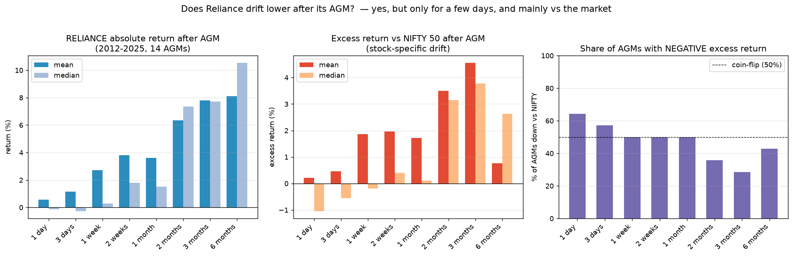

# Does Reliance drift lower after its AGM?

**Short answer: There is a real "sell-the-AGM" dip, but it is small and short-lived
— concentrated in the first 1–5 trading days and visible mainly *relative to the
market*. It is not a persistent downward drift; 1–6 months out Reliance has
historically been higher more often than not. The bearish near-term pattern has,
however, been stronger in the most recent years (2022–2024).**

## Method

- **Stock:** RELIANCE (NSE), daily closes, fully split/bonus adjusted (continuous
  across the 1:1 bonuses of Sep-2017 and Oct-2024).
- **Anchor (T0):** closing price on the AGM trading day.
- **Windows:** forward return at +1d, +3d, +1w (5d), +2w (10d), +1m (21d), +2m (42d),
  +3m (63d), +6m (126d) trading days.
- **Benchmark:** NIFTY 50 over the identical window → **excess return = RIL − NIFTY**,
  which strips out the broad market and isolates stock-specific drift.
- **Sample:** 14 AGMs, 2012–2025 (NIFTY-relative figures use 2012-on; index data
  available from 2007).

## Aggregate result

### Excess return vs NIFTY 50 (the cleanest test of stock-specific drift)

| window  | n  | mean | median | % of AGMs down |
|---------|----|------|--------|----------------|
| 1 day   | 14 | +0.22% | **−1.04%** | **64%** |
| 3 days  | 14 | +0.46% | **−0.55%** | **57%** |
| 1 week  | 14 | +1.86% | −0.19% | 50% |
| 2 weeks | 14 | +1.97% | +0.40% | 50% |
| 1 month | 14 | +1.72% | +0.12% | 50% |
| 2 months| 14 | +3.50% | +3.15% | 36% |
| 3 months| 14 | +4.55% | +3.78% | 29% |
| 6 months| 14 | +0.76% | +2.64% | 43% |

### Absolute Reliance return

| window  | mean | median | % down |
|---------|------|--------|--------|
| 1 day   | +0.56% | −0.14% | 57% |
| 3 days  | +1.16% | −0.26% | 50% |
| 1 week  | +2.70% | +0.28% | 50% |
| 1 month | +3.61% | +1.52% | 36% |
| 3 months| +7.79% | +7.70% | 36% |
| 6 months| +8.10% | +10.52%| 21% |



## Interpretation

1. **The dip is real but tiny and only ~1 week long.** On the AGM day's close,
   the *median* next-day move underperforms NIFTY by ~1%, and RIL underperforms the
   index in **64% of years at +1 day and 57% at +3 days**. This matches the recurring
   headlines ("RIL settles lower after AGM") — the AGM is a classic
   *buy-the-rumour / sell-the-news* event: the run-up happens *into* the meeting and
   unwinds just after.

2. **It is a market-relative effect, not an absolute crash.** In absolute terms the
   first-week numbers are roughly a coin-flip; the underperformance shows up clearly
   only once you net out NIFTY.

3. **No sustained drift lower.** Beyond ~2 weeks the sign flips. At 1–3 months both
   mean and median returns are positive and the share of down-years falls to ~30%.
   Over 6 months RIL was up in ~79% of years (absolute). So "drifts lower" does **not**
   hold as a multi-week/multi-month thesis.

4. **Recent years skew more bearish.** 2022, 2023 and 2024 were negative across most
   short windows, and **2024 stayed weak even at 3–6 months (−15% / −21% absolute)**.
   2019 (+10% next day) and 2018 are the big positive outliers. The 6-month excess
   average is dragged down to ~0 mainly by 2020 (−32% vs a NIFTY that rallied hard
   post-COVID while RIL consolidated after its 2020 surge).

## Caveats

- Small sample (14 events) — single big years (2019, 2020, 2024) move the averages a lot.
- AGM-day close already contains *some* of the reaction (AGMs run during/after hours);
  anchoring at the prior close shifts the +1d number but not the multi-week picture.
- Prices are split/bonus adjusted but not dividend adjusted (RIL yield ~0.3%, negligible).
- 2012 AGM date is approximate (lower confidence); excluding it does not change conclusions.

## Reproduce

```bash
python3 analyze.py        # full per-AGM tables + summary
python3 make_chart.py     # writes post_agm_drift.png
```

## Data sources

- RELIANCE daily OHLCV (split/bonus adjusted): [BennyThadikaran/eod2_data](https://github.com/BennyThadikaran/eod2_data) (NSE EOD).
- NIFTY 50 index: [kalilurrahman/NIFTY_50_STOCK_DATA](https://github.com/kalilurrahman/NIFTY_50_STOCK_DATA).
- AGM dates: contemporaneous coverage on Business Standard / BusinessToday / Upstox and RIL AGM notices (2013–2025 verified; 2012 approximate).
